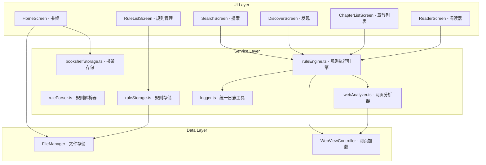
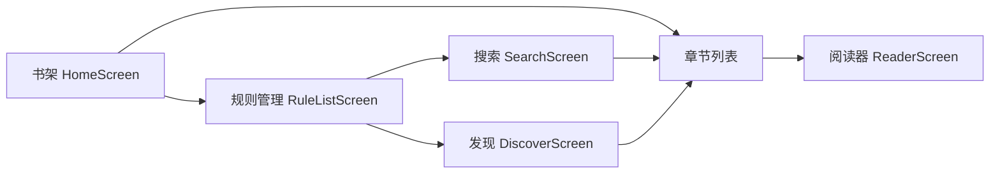
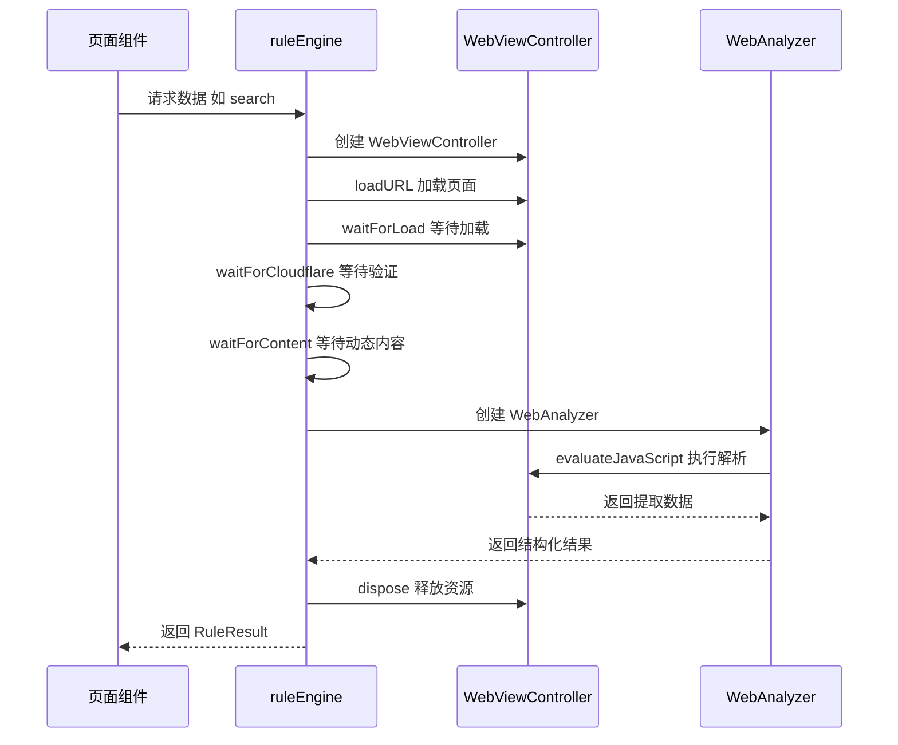

# 系统架构

## 项目结构

```
scripts/
└── Reader/                    # 阅读器脚本
    ├── index.tsx              # 入口文件
    ├── script.json            # 脚本配置
    ├── types.ts               # 类型定义
    ├── changelog.md           # 更新日志
    ├── screens/               # 页面组件
    │   ├── HomeScreen.tsx     # 书架（首页）
    │   ├── RuleListScreen.tsx # 规则管理
    │   ├── SearchScreen.tsx   # 搜索页
    │   ├── DiscoverScreen.tsx # 发现页
    │   ├── ChapterListScreen.tsx # 章节列表
    │   ├── ReaderScreen.tsx   # 阅读器
    │   └── SettingsScreen.tsx # 设置页面
    ├── services/              # 核心服务
    │   ├── index.ts           # 服务导出
    │   ├── logger.ts          # 统一日志工具
    │   ├── ruleEngine.ts      # 规则执行引擎
    │   ├── ruleParser.ts      # 规则解析器
    │   ├── ruleStorage.ts     # 规则存储
    │   ├── bookshelfStorage.ts # 书架存储
    │   └── webAnalyzer.ts     # 网页分析器
    └── components/            # 可复用组件
        └── CommonSections.tsx # 通用 Section 组件
```

## 核心架构图



## 页面导航流程



## 核心服务

### 1. 规则执行引擎 - ruleEngine.ts

负责协调网页加载和内容提取的核心模块。

**主要函数：**

| 函数                                                              | 说明                 |
| ----------------------------------------------------------------- | -------------------- |
| [`search()`](scripts/Reader/services/ruleEngine.ts:152)           | 执行搜索操作         |
| [`getChapterList()`](scripts/Reader/services/ruleEngine.ts:253)   | 获取章节列表         |
| [`getContent()`](scripts/Reader/services/ruleEngine.ts:339)       | 获取正文内容         |
| [`getDiscover()`](scripts/Reader/services/ruleEngine.ts:450)      | 获取发现页内容       |
| [`waitForCloudflare()`](scripts/Reader/services/ruleEngine.ts:72) | 等待 Cloudflare 验证 |

**执行流程：**



### 2. 网页分析器 - webAnalyzer.ts

在 WebView 中执行规则解析的核心模块。

**关键类：**

- [`WebAnalyzer`](scripts/Reader/services/webAnalyzer.ts:176) - 规则执行器

**主要方法：**

| 方法                                                                   | 说明         |
| ---------------------------------------------------------------------- | ------------ |
| [`extractSearchResults()`](scripts/Reader/services/webAnalyzer.ts:230) | 提取搜索结果 |
| [`extractChapterList()`](scripts/Reader/services/webAnalyzer.ts:390)   | 提取章节列表 |
| [`extractContent()`](scripts/Reader/services/webAnalyzer.ts:522)       | 提取正文内容 |
| [`extractSingleValue()`](scripts/Reader/services/webAnalyzer.ts:738)   | 提取单个值   |

**支持的规则类型：**

| 前缀              | 类型       | 说明            |
| ----------------- | ---------- | --------------- |
| `@css:` 或默认    | CSS        | CSS 选择器      |
| `@xpath:` 或 `//` | XPath      | XPath 表达式    |
| `@js:`            | JavaScript | 自定义 JS 代码  |
| `@json:` 或 `$.`  | JSONPath   | JSON 路径表达式 |

**重要约束：**

> ⚠️ `evaluateJavaScript()` 必须使用顶层 `return` 语句，不能使用 IIFE！
> 因为 IIFE 内部的 return 只是函数返回，不是顶层 return。

### 3. 规则存储 - ruleStorage.ts

处理规则的持久化存储。

**存储路径：**

- 规则文件：`FileManager.documentsDirectory/reader/rules.json`

**主要函数：**

| 函数                                                                 | 说明            |
| -------------------------------------------------------------------- | --------------- |
| [`loadRules()`](scripts/Reader/services/ruleStorage.ts:21)           | 加载所有规则    |
| [`saveRules()`](scripts/Reader/services/ruleStorage.ts:45)           | 保存所有规则    |
| [`addRule()`](scripts/Reader/services/ruleStorage.ts:60)             | 添加/更新规则   |
| [`deleteRule()`](scripts/Reader/services/ruleStorage.ts:86)          | 删除规则        |
| [`importRules()`](scripts/Reader/services/ruleStorage.ts:251)        | 批量导入规则    |
| [`updateRulesFromUrl()`](scripts/Reader/services/ruleStorage.ts:182) | 从 URL 更新规则 |

### 4. 统一日志工具 - logger.ts

提供完整的日志链路追踪，方便调试。

**主要特性：**

- 结构化日志格式，包含时间戳和级别标识
- 支持上下文设置（页面、规则、操作、URL）
- 提供多种日志级别：debug、info、warn、error
- 与 ruleEngine 集成，自动记录操作流程

**主要类：**

- [`Logger`](scripts/Reader/services/logger.ts:21) - 日志工具类

**主要方法：**

| 方法                                                     | 说明           |
| -------------------------------------------------------- | -------------- |
| [`setContext()`](scripts/Reader/services/logger.ts:28)   | 设置日志上下文 |
| [`clearContext()`](scripts/Reader/services/logger.ts:35) | 清除上下文     |
| [`debug()`](scripts/Reader/services/logger.ts:67)        | 调试日志       |
| [`info()`](scripts/Reader/services/logger.ts:80)         | 信息日志       |
| [`warn()`](scripts/Reader/services/logger.ts:93)         | 警告日志       |
| [`error()`](scripts/Reader/services/logger.ts:106)       | 错误日志       |
| [`page()`](scripts/Reader/services/logger.ts:119)        | 页面加载日志   |
| [`rule()`](scripts/Reader/services/logger.ts:126)        | 规则使用日志   |
| [`request()`](scripts/Reader/services/logger.ts:139)     | URL 请求日志   |
| [`result()`](scripts/Reader/services/logger.ts:147)      | 操作结果日志   |

**使用示例：**

```typescript
import { logger } from './logger'

// 设置上下文
logger.setContext({ page: '搜索', rule: rule.name, action: '搜索' })

// 记录日志
logger.info(`开始搜索: "${keyword}"`)
logger.request(searchUrl)
logger.result(true, `找到 ${result.data.length} 个结果`)

// 清除上下文
logger.clearContext()
```

### 5. 规则解析器 - ruleParser.ts

提供规则解析的辅助函数（大部分逻辑已迁移到 webAnalyzer.ts）。

**主要函数：**

| 函数                                                             | 说明          |
| ---------------------------------------------------------------- | ------------- |
| [`parseRuleType()`](scripts/Reader/services/ruleParser.ts:16)    | 解析规则类型  |
| [`parseJsonRule()`](scripts/Reader/services/ruleParser.ts:54)    | 解析 JSONPath |
| [`replaceVariables()`](scripts/Reader/services/ruleParser.ts:96) | 替换变量      |

## 数据类型

### UniversalRule - 规则定义

定义于 [`types.ts`](file:///Users/leslie/Documents/Code/Project/Scripting/scripts/Reader/types.ts)：

```typescript
interface UniversalRule {
  // 基本信息
  id: string // 唯一标识
  name: string // 规则名称
  host: string // 域名
  icon?: string // 图标 URL
  contentType: UniversalContentType // 内容类型
  jsLib?: string // JS 函数库

  // 规则配置
  search?: UniversalSearchRule // 搜索规则
  detail?: UniversalDetailRule // 详情规则 (Legado)
  chapter?: UniversalChapterRule // 章节规则
  discover?: UniversalDiscoverRule // 发现规则
  content?: UniversalContentRule // 正文规则

  // 请求设置
  userAgent?: string
  headers?: Record<string, string>
  loadJs?: string

  // 平台特有字段
  anyReader?: AnyReaderBaseFields // any-reader 特有
  legado?: LegadoBaseFields // Legado 特有
}
```

### UniversalContentType - 内容类型枚举

```typescript
enum UniversalContentType {
  NOVEL = 'novel', // 小说
  MANGA = 'manga', // 漫画
  VIDEO = 'video', // 视频
  AUDIO = 'audio', // 音频
  RSS = 'rss', // RSS
  NOVELMORE = 'novelmore' // 小说(增强)
}
```

### RuleResult - 结果类型

```typescript
interface RuleResult<T> {
  success: boolean
  data?: T
  error?: string
  debug?: any
}
```

## 书架数据存储

书架数据使用 FileManager 存储，支持 iCloud 同步：

**存储路径：**

- 书架数据：`FileManager.documentsDirectory/reader/bookshelf.json`
- 设置数据：`FileManager.documentsDirectory/reader/settings.json`

```typescript
type BookshelfItem = SearchItem & {
  ruleId: string // 规则 ID
  ruleName: string // 规则名称
  addedAt: number // 添加时间
  lastReadAt?: number // 最后阅读时间
  lastChapter?: string // 最后阅读章节名
  lastChapterUrl?: string // 最后阅读章节 URL
  lastChapterIndex?: number // 最后阅读章节索引
  latestChapter?: string // 最新章节名
  lastCheckAt?: number // 最后检查更新时间
  hasUpdate?: boolean // 是否有更新
}
```

### 书架存储服务 - bookshelfStorage.ts

提供书架数据的持久化存储，支持 iCloud 同步。

**存储路径：**

- 书架数据：`reader/bookshelf.json`
- 设置数据：`reader/settings.json`

**主要函数：**

| 函数                                                                            | 说明                 |
| ------------------------------------------------------------------------------- | -------------------- |
| [`loadBookshelf()`](scripts/Reader/services/bookshelfStorage.ts:104)            | 加载书架数据         |
| [`saveBookshelf()`](scripts/Reader/services/bookshelfStorage.ts:141)            | 保存书架数据         |
| [`addToBookshelf()`](scripts/Reader/services/bookshelfStorage.ts:157)           | 添加书籍到书架       |
| [`removeFromBookshelf()`](scripts/Reader/services/bookshelfStorage.ts:191)      | 从书架移除书籍       |
| [`batchRemoveFromBookshelf()`](scripts/Reader/services/bookshelfStorage.ts:200) | 批量从书架移除       |
| [`isInBookshelf()`](scripts/Reader/services/bookshelfStorage.ts:210)            | 检查是否在书架中     |
| [`getBookshelfItem()`](scripts/Reader/services/bookshelfStorage.ts:218)         | 获取书架中的书籍     |
| [`updateReadProgress()`](scripts/Reader/services/bookshelfStorage.ts:226)       | 更新阅读进度         |
| [`getReadProgress()`](scripts/Reader/services/bookshelfStorage.ts:256)          | 获取阅读进度         |
| [`sortBookshelf()`](scripts/Reader/services/bookshelfStorage.ts:279)            | 对书架进行排序       |
| [`updateBookLatestChapter()`](scripts/Reader/services/bookshelfStorage.ts:302)  | 更新最新章节信息     |
| [`clearUpdateFlag()`](scripts/Reader/services/bookshelfStorage.ts:327)          | 清除更新标记         |
| [`getUpdateCount()`](scripts/Reader/services/bookshelfStorage.ts:341)           | 获取有更新的书籍数量 |
| [`checkBooksUpdate()`](scripts/Reader/services/bookshelfStorage.ts:403)         | 批量检查书籍更新     |
| [`shouldAutoCheckUpdate()`](scripts/Reader/services/bookshelfStorage.ts:519)    | 检查是否需要自动更新 |
| [`loadSettings()`](scripts/Reader/services/bookshelfStorage.ts:549)             | 加载设置             |
| [`saveSettings()`](scripts/Reader/services/bookshelfStorage.ts:582)             | 保存设置             |
| [`updateSetting()`](scripts/Reader/services/bookshelfStorage.ts:597)            | 更新单个设置项       |

## 关键设计决策

### 1. WebView 执行解析

所有规则解析在 WebView 中执行，原因：

- 可以直接使用浏览器原生的 DOM API
- 支持 CSS 选择器和 XPath
- 可以执行页面上的 JavaScript
- 能正确处理动态加载的内容

### 2. 顶层 return 约束

`evaluateJavaScript()` 的特殊要求：

```javascript
// ✅ 正确：顶层 return
const script = `
  var result = document.querySelector('.title').textContent;
  return result;
`

// ❌ 错误：IIFE 中的 return
const script = `
  (function() {
    return document.querySelector('.title').textContent;
  })();
`
```

### 3. Cloudflare 处理

自动检测并等待 Cloudflare 验证完成：

- 检测页面标题是否包含 "请稍候"、"Just a moment" 等
- 每 500ms 检测一次，最长等待 30 秒
- 验证完成后继续内容提取

### 4. 调试友好设计

每个页面都有调试信息区域：

- 显示当前使用的规则配置
- 显示请求 URL
- 显示解析后的规则结构
- 支持复制调试信息到剪贴板
