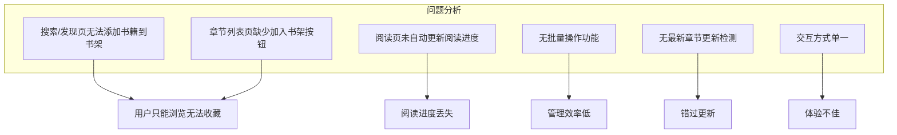
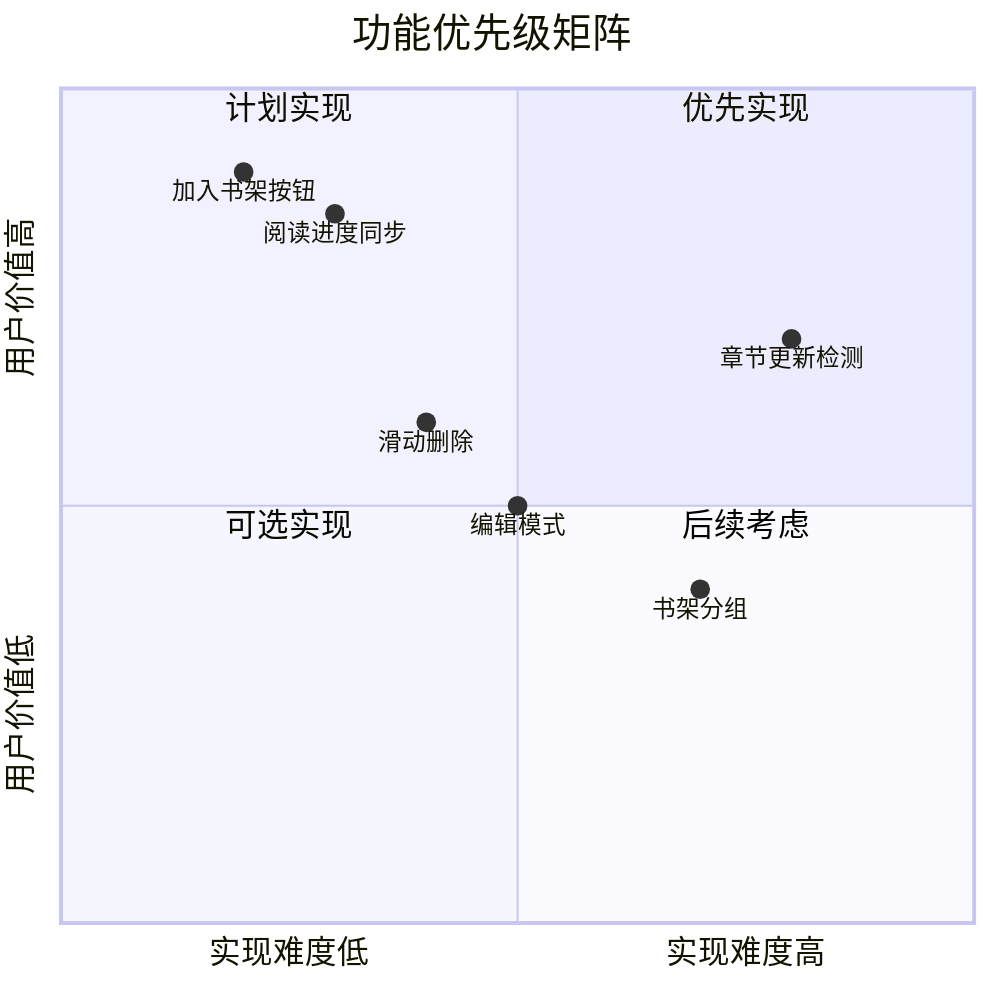
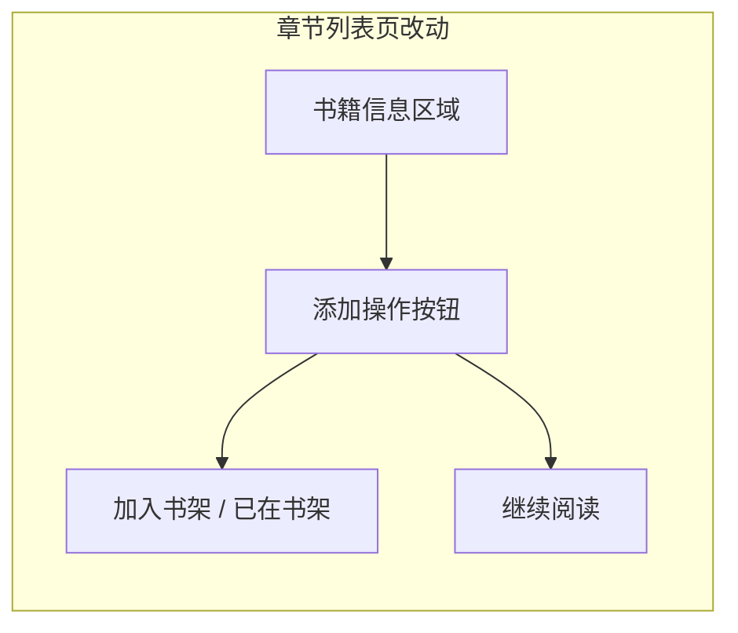
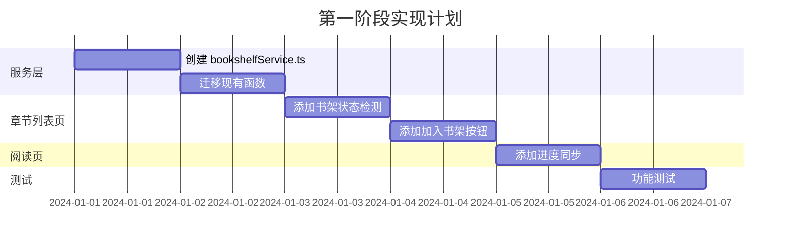

# 书架功能完善方案

## 一、概述

本方案旨在完善 Reader 脚本的书架功能，提升用户体验，实现完整的书籍收藏和阅读进度管理。

## 二、现状分析

### 2.1 已实现功能

| 功能 | 实现位置 | 状态 |
|------|----------|------|
| 书架数据存储 | `HomeScreen.tsx` - Keychain | ✅ |
| 书架列表展示 | `HomeScreen.tsx` | ✅ |
| 从书架进入阅读 | `BookDetailWrapper` | ✅ |
| 单本删除 | `removeBook()` | ✅ |
| 进度记录函数 | `updateReadProgress()` | ✅ 已定义 |
| 添加书籍函数 | `addToBookshelf()` | ✅ 已定义 |

### 2.2 存在问题



## 三、功能规划

### 3.1 优先级划分



### 3.2 功能清单

| 优先级 | 功能 | 说明 |
|--------|------|------|
| P0 | 加入书架 | 章节列表页添加「加入书架」按钮 |
| P0 | 阅读进度同步 | 阅读时自动更新进度 |
| P1 | 书架状态显示 | 章节列表显示是否已收藏 |
| P1 | 滑动删除 | iOS 标准滑动删除交互 |
| P2 | 编辑模式 | 批量选择、批量删除 |
| P2 | 继续阅读 | 书架直接进入上次阅读位置 |
| P3 | 章节更新检测 | 检测收藏书籍的最新章节 |
| P3 | 书架分组 | 按规则/分类/标签分组 |

## 四、详细设计

### 4.1 数据结构优化

```typescript
// 优化后的 BookshelfItem 类型
type BookshelfItem = SearchItem & {
  // 基础信息
  ruleId: string           // 规则 ID
  ruleName: string         // 规则名称
  addedAt: number          // 添加时间
  
  // 阅读进度
  lastReadAt?: number      // 最后阅读时间
  lastChapter?: string     // 最后阅读章节名
  lastChapterUrl?: string  // 最后阅读章节 URL（新增）
  lastChapterIndex?: number // 最后阅读章节索引（新增）
  
  // 更新信息（新增）
  latestChapter?: string   // 最新章节名
  lastCheckAt?: number     // 最后检查更新时间
  hasUpdate?: boolean      // 是否有更新
  
  // 分组（新增，预留）
  groupId?: string         // 分组 ID
}
```

### 4.2 页面改动

#### 4.2.1 ChapterListScreen 改动



**新增功能：**
- 顶部添加「加入书架」按钮
- 如果已在书架，显示「已在书架」状态
- 如果有阅读记录，显示「继续阅读」按钮

**代码变更：**

```tsx
// ChapterListScreen.tsx 新增
import { addToBookshelf, isInBookshelf } from './HomeScreen'

// 新增状态
const [inBookshelf, setInBookshelf] = useState(false)
const [lastReadIndex, setLastReadIndex] = useState<number | null>(null)

// 检查书架状态
useEffect(() => {
  isInBookshelf(item.url).then(setInBookshelf)
  // TODO: 从书架获取上次阅读位置
}, [item.url])

// 书籍信息区域新增按钮
<HStack spacing={12}>
  {inBookshelf ? (
    <Button title="已在书架 ✓" disabled />
  ) : (
    <Button 
      title="加入书架" 
      action={async () => {
        const success = await addToBookshelf(item, rule.id, rule.name)
        if (success) setInBookshelf(true)
      }}
    />
  )}
  {lastReadIndex !== null && (
    <Button 
      title="继续阅读" 
      action={() => /* 跳转到对应章节 */}
    />
  )}
</HStack>
```

#### 4.2.2 ReaderScreen 改动

**新增功能：**
- 阅读时自动更新进度
- 切换章节时同步进度

**代码变更：**

```tsx
// ReaderScreen.tsx 新增
import { updateReadProgress, isInBookshelf } from './HomeScreen'

// 新增属性
type ReaderScreenProps = {
  rule: Rule
  chapter: ChapterItem
  bookName: string
  bookUrl: string        // 新增：书籍 URL
  chapters: ChapterItem[]
  currentIndex: number
}

// 更新阅读进度
useEffect(() => {
  // 检查是否在书架中，如果是则更新进度
  isInBookshelf(bookUrl).then(inShelf => {
    if (inShelf) {
      updateReadProgress(bookUrl, currentChapter.name, chapterIndex)
    }
  })
}, [chapterIndex, currentChapter.name])
```

#### 4.2.3 HomeScreen 改动

**新增功能：**
- 滑动删除
- 编辑模式
- 点击直接继续阅读（跳转到上次阅读章节）

**代码变更示例：**

```tsx
// 滑动删除（使用 swipeActions）
<List>
  {books.map((book) => (
    <NavigationLink
      key={book.url}
      destination={<BookDetailWrapper book={book} />}
      swipeActions={{
        trailing: [
          {
            title: '删除',
            style: 'destructive',
            action: () => removeBook(book.url)
          }
        ]
      }}
    >
      {/* 书籍内容 */}
    </NavigationLink>
  ))}
</List>
```

### 4.3 服务层改动

#### 4.3.1 bookshelfStorage.ts（新建）

将书架相关逻辑从 HomeScreen 抽离到独立服务：

```typescript
// services/bookshelfStorage.ts

// 存储路径（支持 iCloud 同步）
const BOOKSHELF_FILE_NAME = 'reader/bookshelf.json'
const SETTINGS_FILE_NAME = 'reader/settings.json'

export interface BookshelfItem {
  // ... 类型定义
}

/**
 * 加载书架数据
 */
export async function loadBookshelf(): Promise<BookshelfItem[]> {
  // ...
}

/**
 * 保存书架数据
 */
export async function saveBookshelf(items: BookshelfItem[]): Promise<void> {
  // ...
}

/**
 * 添加书籍到书架
 */
export async function addToBookshelf(
  item: SearchItem,
  ruleId: string,
  ruleName: string
): Promise<boolean> {
  // ...
}

/**
 * 从书架移除书籍
 */
export async function removeFromBookshelf(url: string): Promise<void> {
  // ...
}

/**
 * 更新阅读进度
 */
export async function updateReadProgress(
  url: string,
  chapterName: string,
  chapterIndex?: number,
  chapterUrl?: string
): Promise<void> {
  // ...
}

/**
 * 检查是否在书架中
 */
export async function isInBookshelf(url: string): Promise<boolean> {
  // ...
}

/**
 * 获取阅读进度
 */
export async function getReadProgress(url: string): Promise<{
  chapterName?: string
  chapterIndex?: number
  chapterUrl?: string
} | null> {
  // ...
}

/**
 * 批量删除
 */
export async function batchRemove(urls: string[]): Promise<void> {
  // ...
}
```

## 五、UI 设计

### 5.1 章节列表页操作区

```
┌─────────────────────────────────────┐
│  [封面]  书名                        │
│          作者: xxx                   │
│          最新: 第xxx章               │
│                                     │
│  ┌─────────────┐ ┌─────────────┐    │
│  │  加入书架   │ │  继续阅读   │    │
│  └─────────────┘ └─────────────┘    │
└─────────────────────────────────────┘
```

### 5.2 书架列表滑动删除

```
┌─────────────────────────────────────┐
│  书籍1                         ←滑动 │
│                         ┌────────┐  │
│                         │  删除  │  │
│                         └────────┘  │
├─────────────────────────────────────┤
│  书籍2                              │
├─────────────────────────────────────┤
│  书籍3                              │
└─────────────────────────────────────┘
```

### 5.3 书架编辑模式

```
┌─────────────────────────────────────┐
│ 书架                     [取消][删除]│
├─────────────────────────────────────┤
│ ○ 书籍1                             │
│ ● 书籍2                             │
│ ● 书籍3                             │
│ ○ 书籍4                             │
└─────────────────────────────────────┘
        底部: [全选] 已选择 2 项
```

## 六、实现计划

### 第一阶段（核心功能）



**具体任务：**

1. **创建 bookshelfService.ts**
   - 抽离书架相关逻辑
   - 增强类型定义
   - 添加新方法

2. **ChapterListScreen 改动**
   - 添加书架状态检测
   - 添加「加入书架」按钮
   - 添加「继续阅读」按钮

3. **ReaderScreen 改动**
   - 添加阅读进度自动同步
   - 传递 bookUrl 参数

4. **HomeScreen 改动**
   - 使用新的 bookshelfService
   - 优化导入

### 第二阶段（交互优化）

1. **滑动删除**
   - HomeScreen 添加 swipeActions

2. **编辑模式**
   - 添加编辑状态
   - 多选支持
   - 批量删除

### 第三阶段（增强功能）

1. **章节更新检测**
   - 后台检测最新章节
   - 更新提示

2. **书架分组**
   - 分组数据结构
   - 分组 UI

## 七、文件变更清单

| 文件 | 变更类型 | 说明 |
|------|----------|------|
| `services/bookshelfStorage.ts` | 新建 | 书架服务层 |
| `screens/HomeScreen.tsx` | 修改 | 使用服务层、添加滑动删除 |
| `screens/ChapterListScreen.tsx` | 修改 | 添加书架操作 |
| `screens/ReaderScreen.tsx` | 修改 | 添加进度同步 |
| `screens/SettingsScreen.tsx` | 新建 | 设置页面 |
| `types.ts` | 修改 | 更新 BookshelfItem 类型 |

## 八、风险评估

| 风险 | 影响 | 缓解措施 |
|------|------|----------|
| ~~Keychain 存储限制~~ | ~~数据丢失~~ | ✅ 已迁移到 FileManager + iCloud |
| 阅读进度频繁写入 | 性能问题 | 添加节流，章节切换时写入 |
| 规则删除后书架数据 | 数据不一致 | 加载时校验规则存在性 |

## 九、测试要点

1. **加入书架**
   - 从搜索结果加入
   - 从发现页加入
   - 重复添加提示

2. **阅读进度**
   - 切换章节后进度更新
   - 从书架进入恢复进度
   - 跨规则同书籍处理

3. **删除功能**
   - 滑动删除确认
   - 批量删除确认
   - 删除后列表刷新

---

**文档版本**: 1.1
**创建日期**: 2024-12-16
**更新日期**: 2024-12-16
**状态**: 已实现

### 变更记录

| 版本 | 日期 | 变更内容 |
|------|------|----------|
| 1.0 | 2024-12-16 | 初始版本 |
| 1.1 | 2024-12-16 | 更新存储路径为 `reader/*` 格式，更新服务文件名为 `bookshelfStorage.ts`，添加设置页面 |